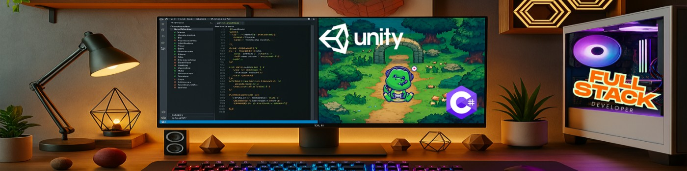

<div align="center">
  
</div>

<br/>

<div align="center">

# Lucas Fukuta

<a href="https://git.io/typing-svg">
  
</a>

<br/>

[](https://www.linkedin.com/in/lucasfukuta/)
[](mailto:lucasfukuta@gmail.com)
[](https://github.com/lucasfukuta?tab=repositories)

</div>

---

### Sobre mim

Sou **C# developer** focado no **.NET ecosystem**, com forte interesse técnico em engenharia de backend, arquitetura de software, desenvolvimento de jogos e Inteligência Artificial.

Meu principal foco profissional é **.NET / C#**, particularmente o desenvolvimento backend com **ASP.NET Core**, construindo APIs RESTful limpas e arquiteturas de aplicação robustas.

Também trabalho com **Unity e C#** como domínio complementar, explorando sistemas de gameplay, arquitetura de jogos, NPCs inteligentes e Inteligência Artificial aplicada a experiências interativas.

🎓 Atualmente estou cursando **Mestrado em Sistemas de Computação na Universidade de Brasília (UnB / PPGI)**, pesquisando NPCs inteligentes, memória persistente e continuidade narrativa utilizando tecnologias de IA local.

Possuo pós-graduação em **Desenvolvimento Full Stack** pelo UniCEUB e formação acadêmica em **Ciência de Dados**.

---

### Stacks & Habilidades

<table align="center" width="100%">
  <thead>
    <tr>
      <th width="25%">Área</th>
      <th>Tecnologias & Ferramentas</th>
    </tr>
  </thead>
  <tbody>
    <tr>
      <td align="center"><strong>Backend & APIs</strong></td>
      <td>
        
        
        
        
        
        
        
        
        
      </td>
    </tr>
    <tr>
      <td align="center"><strong>Frontend Web</strong></td>
      <td>
        
        
        
        
        
        
        
        
      </td>
    </tr>
    <tr>
      <td align="center"><strong>Mobile Multiplataforma</strong></td>
      <td>
        
        
        
        
        
      </td>
    </tr>
    <tr>
      <td align="center"><strong>Game Development</strong></td>
      <td>
        
        
        
        
      </td>
    </tr>
    <tr>
      <td align="center"><strong>Ferramentas & Workflow</strong></td>
      <td>
        
        
        
        
        
      </td>
    </tr>
  </tbody>
</table>

---

### 🚀 Projetos em Destaque

<div align="center">
<table width="100%">
  <tr>
    <td width="50%" valign="top">
      <h3 align="center">🪐 Tasks Manager — Web App</h3>
      <p align="center">
        
        
        
      </p>
      <p>Gerenciador de tarefas moderno com tema espacial/cyberpunk. Possui autenticação com tokens JWT, Context API para gerenciamento de sessão global, filtros por prioridade e abas em formato de planetas.</p>
      <p align="center">
        <a href="https://github.com/lucasfukuta"><strong>Explore o Código »</strong></a>
      </p>
    </td>
    <td width="50%" valign="top">
      <h3 align="center">🦸‍♂️ Super Heroes CRUD</h3>
      <p align="center">
        
        
        
      </p>
      <p>Aplicação Full-Stack com Blazor WebAssembly e ASP.NET Core Web API. Interface moderna baseada em Material Design (MudBlazor) com operações CRUD completas, modais dinâmicos e persistência em SQL Server.</p>
      <p align="center">
        <a href="https://github.com/lucasfukuta"><strong>Explore o Código »</strong></a>
      </p>
    </td>
  </tr>
  <tr>
    <td width="50%" valign="top">
      <h3 align="center">🏢 Hubbetech — Gestão Corporativa</h3>
      <p align="center">
        
        
        
      </p>
      <p>Sistema completo de gestão empresarial com arquitetura Blazor WebAssembly Hosted no .NET 8. Centraliza demandas e tarefas corporativas, controle de patrimônio/equipamentos, gestão de colaboradores e catálogo de links úteis.</p>
      <p align="center">
        <a href="https://github.com/lucasfukuta"><strong>Explore o Código »</strong></a>
      </p>
    </td>
    <td width="50%" valign="top">
      <h3 align="center">🐾 MyBeastAPP — Fitness & Gamificação</h3>
      <p align="center">
        
        
        
      </p>
      <p>Plataforma fitness construída com Clean Architecture em .NET. Acompanhamento de rotinas de treino, métricas de evolução, controle nutricional/refeições, comunidade com desafios sociais e pets virtuais que evoluem com a constância do usuário.</p>
      <p align="center">
        <a href="https://github.com/lucasfukuta"><strong>Explore o Código »</strong></a>
      </p>
    </td>
  </tr>
  <tr>
    <td width="50%" valign="top">
      <h3 align="center">🐔 GoChicken — 3D Endless Runner</h3>
      <p align="center">
        
        
        
      </p>
      <p>Jogo 3D no estilo Zig-Zag Runner com plataformas instanciadas proceduralmente em tempo real, física de desmoronamento dinâmico com Rigidbody, predadores no caminho e sistema de High Score persistente.</p>
      <p align="center">
        <a href="https://github.com/lucasfukuta"><strong>Explore o Código »</strong></a>
      </p>
    </td>
    <td width="50%" valign="top">
      <h3 align="center">🍱 Itadakimasu — Mobile App</h3>
      <p align="center">
        
        
        
      </p>
      <p>Aplicativo gastronômico multiplataforma desenvolvido em Flutter com alternância em tempo real entre temas Claro e Escuro, carrosséis de categorias culinárias, cards de restaurantes e feed social da comunidade.</p>
      <p align="center">
        <a href="https://github.com/lucasfukuta"><strong>Explore o Código »</strong></a>
      </p>
    </td>
  </tr>
</table>
</div>

---
## 🔬 Pesquisa Acadêmica — NPCs Inteligentes & IA Local

Minha pesquisa de Mestrado na **Universidade de Brasília (UnB / PPGI)** tem como foco NPCs inteligentes e narrativa persistente para jogos, utilizando arquiteturas de IA local em hardware de consumo sem dependência de nuvem.

```
                   Unity Engine
                        │
                        ▼
                 Control Module
                        │
          ┌─────────────┴─────────────┐
          ▼                           ▼
      Local SLM                Knowledge Graph
          │                           │
          └─────────────┬─────────────┘
                        ▼
            RAG (Context Retrieval)
                        │
                        ▼
              Persistent NPC Memory
                        │
                        ▼
             Emergent Narrative Flow
```

- **Áreas de Foco:** Small Language Models (SLMs), Execução de IA Local, Retrieval-Augmented Generation (RAG), Grafos de Conhecimento (Knowledge Graphs), Memória Persistente de NPCs.

---
## 🎓 Formação Acadêmica

- **🎓 Mestrado — Sistemas de Computação** *(Em andamento)*  
  *Universidade de Brasília — UnB / PPGI*  
  Pesquisa: NPCs inteligentes, narrativa persistente, SLMs locais e IA para jogos.

- **🎓 Pós-Graduação — Desenvolvimento Full Stack**  
  *UniCEUB*  
  Foco: C#, Ecossistema .NET, Desenvolvimento Web, Bancos de Dados, Arquitetura de Backend.

- **🎓 Formação Acadêmica — Ciência de Dados**  
  Formação acadêmica em Ciência de Dados, estatística e engenharia de software.

---

### 📬 Conecte-se Comigo

<div align="center">

Vamos bater um papo sobre tecnologia, projetos ou novas oportunidades?

<br/>

<a href="https://www.linkedin.com/in/lucasfukuta/" target="_blank">
  
</a>
&nbsp;&nbsp;
<a href="mailto:lucasfukuta@gmail.com" target="_blank">
  
</a>
&nbsp;&nbsp;
<a href="https://github.com/lucasfukuta" target="_blank">
  
</a>

<br/><br/>


</div>
